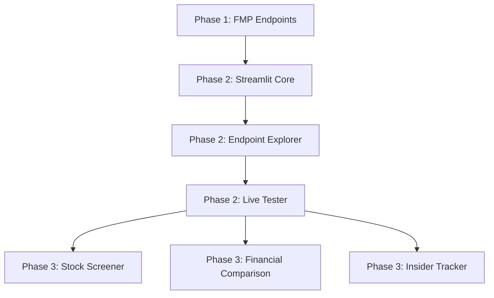

# ACTION PLAN: FMP API Bővítés & Streamlit Prezentáció

> **Projekt:** OmniData Nexus Core - FMP Extension
> **Verzió:** v1.3.0 → v1.5.0
> **Kezdés:** 2026-02-01
> **Státusz:** PLANNING

---

## Tartalomjegyzék

1. [Összefoglaló](#1-összefoglaló)
2. [Git Stratégia](#2-git-stratégia)
3. [Phase 1: FMP Endpoint Bővítés](#3-phase-1-fmp-endpoint-bővítés)
4. [Phase 2: Streamlit Prezentáció](#4-phase-2-streamlit-prezentáció)
5. [Phase 3: Speciális Modulok](#5-phase-3-speciális-modulok)
6. [Függőségek](#6-függőségek)
7. [Acceptance Criteria](#7-acceptance-criteria)
8. [Kockázatok](#8-kockázatok)

---

## 1. Összefoglaló

### Célok

| Cél | Leírás |
|-----|--------|
| **FMP lefedettség** | 13 → 150+ endpoint (teljes API) |
| **Prezentációs réteg** | Streamlit-alapú endpoint explorer és dashboard |
| **Architektúra** | Kategória-alapú moduláris provider struktúra |

### Mérföldkövek

| Verzió | Milestone | Tartalom |
|--------|-----------|----------|
| v1.3.0 | FMP Complete | 150+ endpoint implementálva |
| v1.4.0 | Streamlit MVP | Endpoint explorer, live tester |
| v1.5.0 | Dashboards | Stock screener, comparisons |

### Endpoint Összesítés

| Kategória | Endpoint szám | Prioritás |
|-----------|---------------|-----------|
| 3.1 Search & Directory | 12 | HIGH |
| 3.2 Company Information | 13 | HIGH |
| 3.3 Quotes | 13 | HIGH |
| 3.4 Financial Statements | 22 | HIGH |
| 3.5 Charts | 10 | MEDIUM |
| 3.6 Economics | 4 | MEDIUM |
| 3.7 Calendars & Events | 9 | MEDIUM |
| 3.8 Earnings Transcripts | 4 | MEDIUM |
| 3.9 News | 9 | MEDIUM |
| 3.10 Institutional (13F) | 7 | MEDIUM |
| 3.11 Analyst | 8 | HIGH |
| 3.12 Market Performance | 9 | MEDIUM |
| 3.13 Technical Indicators | 9 | LOW |
| 3.14 ETF & Mutual Funds | 7 | MEDIUM |
| 3.15 SEC Filings | 7 | MEDIUM |
| 3.16 Insider Trading | 6 | MEDIUM |
| 3.17 Indexes | 7 | MEDIUM |
| 3.18 Forex | 6 | LOW |
| 3.19 Cryptocurrencies | 6 | LOW |
| 3.20 Commodities | 4 | LOW |
| 3.21 Congressional Trading | 6 | LOW |
| 3.22 ESG | 3 | LOW |
| 3.23 DCF Valuation | 4 | HIGH |
| 3.24 Other | 4 | LOW |
| **TOTAL** | **~189** | - |

---

## 2. Git Stratégia

### Branch Struktúra

```
main                              # Production-ready, stabil
  │
  └── develop                     # Integráció, CI fut rajta
        │
        ├── feature/fmp-search         # 3.1 Search & Directory
        ├── feature/fmp-company        # 3.2 Company Information
        ├── feature/fmp-quotes         # 3.3 Quotes
        ├── feature/fmp-financials     # 3.4 Financial Statements
        ├── feature/fmp-charts         # 3.5 Charts
        ├── feature/fmp-economics      # 3.6 Economics
        ├── feature/fmp-calendars      # 3.7 Calendars & Events
        ├── feature/fmp-transcripts    # 3.8 Earnings Transcripts
        ├── feature/fmp-news           # 3.9 News
        ├── feature/fmp-institutional  # 3.10 Institutional
        ├── feature/fmp-analyst        # 3.11 Analyst
        ├── feature/fmp-performance    # 3.12 Market Performance
        ├── feature/fmp-technical      # 3.13 Technical Indicators
        ├── feature/fmp-etf            # 3.14 ETF & Mutual Funds
        ├── feature/fmp-sec            # 3.15 SEC Filings
        ├── feature/fmp-insider        # 3.16 Insider Trading
        ├── feature/fmp-indexes        # 3.17 Indexes
        ├── feature/fmp-forex          # 3.18 Forex
        ├── feature/fmp-crypto         # 3.19 Cryptocurrencies
        ├── feature/fmp-commodities    # 3.20 Commodities
        ├── feature/fmp-congress       # 3.21 Congressional Trading
        ├── feature/fmp-esg            # 3.22 ESG
        ├── feature/fmp-dcf            # 3.23 DCF Valuation
        ├── feature/fmp-other          # 3.24 Other
        │
        ├── feature/streamlit-core     # Streamlit alap
        ├── feature/streamlit-explorer # Endpoint explorer
        ├── feature/streamlit-tester   # Live API tester
        └── feature/streamlit-dashboard # Dashboardok
```

### Workflow

1. **Feature Development**
   ```bash
   git checkout develop
   git pull origin develop
   git checkout -b feature/fmp-company
   # ... fejlesztés ...
   git push -u origin feature/fmp-company
   # PR → develop
   ```

2. **Release**
   ```bash
   git checkout develop
   git checkout -b release/v1.3.0
   # verzió bump, changelog
   git checkout main
   git merge release/v1.3.0 --no-ff
   git tag v1.3.0
   git push origin main --tags
   ```

3. **Commit Convention**
   ```
   feat(fmp-company): add profile endpoint
   feat(fmp-company): add employee-count endpoint
   test(fmp-company): add unit tests for profile
   docs(fmp): update endpoint tracker
   ```

---

## 3. Phase 1: FMP Endpoint Bővítés

**Target Version:** v1.3.0
**Branch:** `develop` ← `feature/fmp-*`

### Sprint 1.1: Core Foundation

| Task | Branch | Státusz |
|------|--------|---------|
| Provider architektúra refactor | `feature/fmp-architecture` | TODO |
| Kategória-alapú modul struktúra | `feature/fmp-architecture` | TODO |
| Endpoint registry pattern | `feature/fmp-architecture` | TODO |
| Base endpoint decorator | `feature/fmp-architecture` | TODO |

**Fájl struktúra:**
```
src/data_loader/providers/fmp/
├── __init__.py           # Public API
├── base.py               # FMPBaseProvider
├── registry.py           # Endpoint registry
├── search.py             # 3.1 Search & Directory
├── company.py            # 3.2 Company Information
├── quotes.py             # 3.3 Quotes
├── financials.py         # 3.4 Financial Statements
├── charts.py             # 3.5 Charts
├── economics.py          # 3.6 Economics
├── calendars.py          # 3.7 Calendars & Events
├── transcripts.py        # 3.8 Earnings Transcripts
├── news.py               # 3.9 News
├── institutional.py      # 3.10 Institutional
├── analyst.py            # 3.11 Analyst
├── performance.py        # 3.12 Market Performance
├── technical.py          # 3.13 Technical Indicators
├── etf.py                # 3.14 ETF & Mutual Funds
├── sec.py                # 3.15 SEC Filings
├── insider.py            # 3.16 Insider Trading
├── indexes.py            # 3.17 Indexes
├── forex.py              # 3.18 Forex
├── crypto.py             # 3.19 Cryptocurrencies
├── commodities.py        # 3.20 Commodities
├── congress.py           # 3.21 Congressional Trading
├── esg.py                # 3.22 ESG
├── dcf.py                # 3.23 DCF Valuation
└── other.py              # 3.24 Other
```

### Sprint 1.2: High Priority Endpoints

| Kategória | Branch | Endpoint szám | Státusz |
|-----------|--------|---------------|---------|
| 3.1 Search & Directory | `feature/fmp-search` | 12 | TODO |
| 3.2 Company Information | `feature/fmp-company` | 13 | TODO |
| 3.3 Quotes | `feature/fmp-quotes` | 13 | TODO |
| 3.4 Financial Statements | `feature/fmp-financials` | 22 | TODO |
| 3.11 Analyst | `feature/fmp-analyst` | 8 | TODO |
| 3.23 DCF Valuation | `feature/fmp-dcf` | 4 | TODO |

**Részletes endpoint lista:** Lásd [FMP_ENDPOINTS_TRACKER.md](FMP_ENDPOINTS_TRACKER.md)

### Sprint 1.3: Medium Priority Endpoints

| Kategória | Branch | Endpoint szám | Státusz |
|-----------|--------|---------------|---------|
| 3.5 Charts | `feature/fmp-charts` | 10 | TODO |
| 3.6 Economics | `feature/fmp-economics` | 4 | TODO |
| 3.7 Calendars | `feature/fmp-calendars` | 9 | TODO |
| 3.8 Transcripts | `feature/fmp-transcripts` | 4 | TODO |
| 3.9 News | `feature/fmp-news` | 9 | TODO |
| 3.10 Institutional | `feature/fmp-institutional` | 7 | TODO |
| 3.12 Performance | `feature/fmp-performance` | 9 | TODO |
| 3.14 ETF | `feature/fmp-etf` | 7 | TODO |
| 3.15 SEC | `feature/fmp-sec` | 7 | TODO |
| 3.16 Insider | `feature/fmp-insider` | 6 | TODO |
| 3.17 Indexes | `feature/fmp-indexes` | 7 | TODO |

### Sprint 1.4: Low Priority Endpoints

| Kategória | Branch | Endpoint szám | Státusz |
|-----------|--------|---------------|---------|
| 3.13 Technical | `feature/fmp-technical` | 9 | TODO |
| 3.18 Forex | `feature/fmp-forex` | 6 | TODO |
| 3.19 Crypto | `feature/fmp-crypto` | 6 | TODO |
| 3.20 Commodities | `feature/fmp-commodities` | 4 | TODO |
| 3.21 Congress | `feature/fmp-congress` | 6 | TODO |
| 3.22 ESG | `feature/fmp-esg` | 3 | TODO |
| 3.24 Other | `feature/fmp-other` | 4 | TODO |

---

## 4. Phase 2: Streamlit Prezentáció

**Target Version:** v1.4.0
**Branch:** `develop` ← `feature/streamlit-*`
**Dependency:** Phase 1 complete

### Projekt Struktúra

```
streamlit_app/
├── app.py                    # Main entry point
├── config.py                 # App configuration
├── requirements.txt          # Streamlit dependencies
│
├── pages/
│   ├── 01_endpoint_explorer.py
│   ├── 02_live_tester.py
│   ├── 03_response_viewer.py
│   └── 04_cache_inspector.py
│
├── components/
│   ├── endpoint_selector.py  # Kategória/endpoint választó
│   ├── param_builder.py      # Paraméter form builder
│   ├── response_display.py   # JSON/Table megjelenítő
│   └── sidebar.py            # Navigáció
│
├── utils/
│   ├── api_client.py         # Nexus Core wrapper
│   ├── formatters.py         # Adat formázók
│   └── exporters.py          # CSV/JSON export
│
└── assets/
    ├── style.css
    └── logo.png
```

### Sprint 2.1: Core Application

| Task | Branch | Státusz |
|------|--------|---------|
| Streamlit projekt setup | `feature/streamlit-core` | TODO |
| Konfiguráció (.env, settings) | `feature/streamlit-core` | TODO |
| Alap layout és navigáció | `feature/streamlit-core` | TODO |
| Nexus Core integráció | `feature/streamlit-core` | TODO |

### Sprint 2.2: Endpoint Explorer

| Task | Branch | Státusz |
|------|--------|---------|
| Kategória listázó (24 kategória) | `feature/streamlit-explorer` | TODO |
| Endpoint listázó per kategória | `feature/streamlit-explorer` | TODO |
| Endpoint részletek (params, tier) | `feature/streamlit-explorer` | TODO |
| Keresés és szűrés | `feature/streamlit-explorer` | TODO |

### Sprint 2.3: Live API Tester

| Task | Branch | Státusz |
|------|--------|---------|
| Paraméter form dinamikus generálás | `feature/streamlit-tester` | TODO |
| API hívás végrehajtás | `feature/streamlit-tester` | TODO |
| Response megjelenítés (JSON tree) | `feature/streamlit-tester` | TODO |
| Response megjelenítés (táblázat) | `feature/streamlit-tester` | TODO |
| Cache státusz jelzés | `feature/streamlit-tester` | TODO |
| Hibakezelés UI | `feature/streamlit-tester` | TODO |

### Sprint 2.4: Export & Utilities

| Task | Branch | Státusz |
|------|--------|---------|
| JSON export | `feature/streamlit-export` | TODO |
| CSV export | `feature/streamlit-export` | TODO |
| Cache inspector | `feature/streamlit-export` | TODO |
| Health dashboard | `feature/streamlit-export` | TODO |

---

## 5. Phase 3: Speciális Modulok

**Target Version:** v1.5.0
**Branch:** `develop` ← `feature/streamlit-dashboard-*`
**Dependency:** Phase 2 complete

### Sprint 3.1: Stock Screener

| Task | Branch | Státusz |
|------|--------|---------|
| Screener UI layout | `feature/streamlit-screener` | TODO |
| Filter builder (sector, market cap, etc.) | `feature/streamlit-screener` | TODO |
| Results table with sorting | `feature/streamlit-screener` | TODO |
| Watchlist export | `feature/streamlit-screener` | TODO |

### Sprint 3.2: Financial Comparison

| Task | Branch | Státusz |
|------|--------|---------|
| Multi-ticker selector | `feature/streamlit-comparison` | TODO |
| Side-by-side financial tables | `feature/streamlit-comparison` | TODO |
| Ratio comparison charts | `feature/streamlit-comparison` | TODO |
| Historical trend overlay | `feature/streamlit-comparison` | TODO |

### Sprint 3.3: Insider/Congress Tracker

| Task | Branch | Státusz |
|------|--------|---------|
| Recent trades feed | `feature/streamlit-tracker` | TODO |
| Trader profile lookup | `feature/streamlit-tracker` | TODO |
| Trade volume heatmap | `feature/streamlit-tracker` | TODO |
| Alerts (largest trades) | `feature/streamlit-tracker` | TODO |

---

## 6. Függőségek



### Kritikus Függőségek

| Forrás | Cél | Típus |
|--------|-----|-------|
| Sprint 1.1 (Architecture) | Minden Sprint 1.x | BLOCKING |
| Phase 1 complete | Phase 2 start | BLOCKING |
| Sprint 2.1 (Core) | Sprint 2.2-2.4 | BLOCKING |
| Sprint 2.3 (Tester) | Phase 3 | BLOCKING |

### Technikai Függőségek

| Komponens | Függőség |
|-----------|----------|
| Streamlit app | `streamlit>=1.30.0` |
| Grafikonok | `plotly>=5.18.0` |
| Táblázatok | `pandas>=2.0.0` |
| Nexus Core | `aiohttp>=3.9.0` |

---

## 7. Acceptance Criteria

### Phase 1 (v1.3.0)

- [ ] Minden 189 endpoint implementálva
- [ ] Minden endpoint tesztelve (unit test)
- [ ] Endpoint registry működik (discovery)
- [ ] Backward compatible (régi 13 endpoint működik)
- [ ] Dokumentáció frissítve
- [ ] CI zöld

### Phase 2 (v1.4.0)

- [ ] Streamlit app indul és működik
- [ ] 24 kategória navigálható
- [ ] Bármely endpoint tesztelhető
- [ ] Response JSON és táblázat nézetben
- [ ] Export működik (JSON, CSV)
- [ ] Cache státusz látható
- [ ] Responsive design (desktop/tablet)

### Phase 3 (v1.5.0)

- [ ] Stock screener működik
- [ ] Multi-ticker comparison működik
- [ ] Insider tracker működik
- [ ] Performance elfogadható (<3s page load)

---

## 8. Kockázatok

| Kockázat | Valószínűség | Hatás | Mitigáció |
|----------|--------------|-------|-----------|
| FMP API változás | LOW | HIGH | Endpoint verzionálás, tesztek |
| Bandwidth limit | MEDIUM | MEDIUM | Cache stratégia, batch requests |
| Streamlit performance | LOW | MEDIUM | Lazy loading, caching |
| Scope creep | MEDIUM | HIGH | Szigorú sprint boundaries |

---

## Revision History

| Verzió | Dátum | Változás |
|--------|-------|----------|
| v1.0 | 2026-02-01 | Initial plan |

---

*Részletes endpoint tracking: [FMP_ENDPOINTS_TRACKER.md](FMP_ENDPOINTS_TRACKER.md)*
